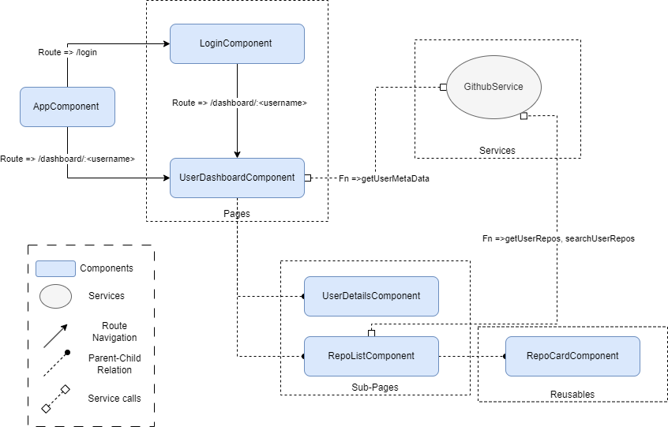

# Github Repository Lister

A project which gets a github username to list all its public repositories. 

[Demo](https://b3nj4m.github.io/barchart)

## Architecture diagram and Folder Structure

### Pages

Pages are components which has a route to access.

#### `LoginComponent`

| #     | Details      |
| :------------ |   :---      |
| Description        | Takes `username` from users and gets navigates to `UserDashboardComponent`components.         |
| Route         | /login           |
| Services        | None         |
| Test cases         | None         |

#### `UserDashboardComponent`

| #     | Details      |
| :------------ |   :---      |
| Description        | Gets `username` available in route params and calls the `getUserMetaData` to get the user details. Passes user details to its child components.         |
| Route         | /dashboard/:username          |
| Services        | GithubService, MessageService         |
| Test cases         | None         |

### Sub-Pages

Sub-pages are components which is not a page neither a reusable. Components which are used only once.

#### `AppComponent`

| #     | Details      |
| :------------ |   :---      |
| Description        | Controls the route and it is the bootstrapping component(default).         |
| Services         | None         |
| Test cases         | None         |

#### `RepoListComponent`

| #     | Details      |
| :------------ |   :---      |
| Description        | Get all repositories for a given `username`. Supports pagination and serach functionalities. Iterates all repositories and pass each repository to its child.         |
| Inputs         | username, userMetadata          |
| Services         | GithubService, MessageService         |
| Test cases         | None         |

#### `UserDetailsComponent`

| #     | Details      |
| :------------ |   :---      |
| Description        | Get the `userMetaData` from `UserDashbaordComponent` to render all user meta data's.         |
| Inputs         | username         |
| Services         | None         |
| Test cases         | None         |

### Reusables

Reusables are components which are used in multiple places.

#### `RepoCardComponent`

| #     | Details      |
| :------------ |   :---      |
| Description        | Gets `repo` from `RepoListComponent` to render all the repository meta data's.         |
| Inputs         | repo         |
| Services         | None         |
| Test cases         | None         |

## Setup

### Development server

Run `npm run start` for a dev server and navigate to `http://localhost:4200/`.

### Development Build

Run `npm run dev-build` to build the project in development configuration. Source map available for debugging purposes.

### Production Build

Run `npm run build` to build the project in production configuration.

### Running unit tests

Run `npm run test` to execute the unit tests. Code coverage for the unit tests will get generated in  `coverage/github-repo-lister` directory

